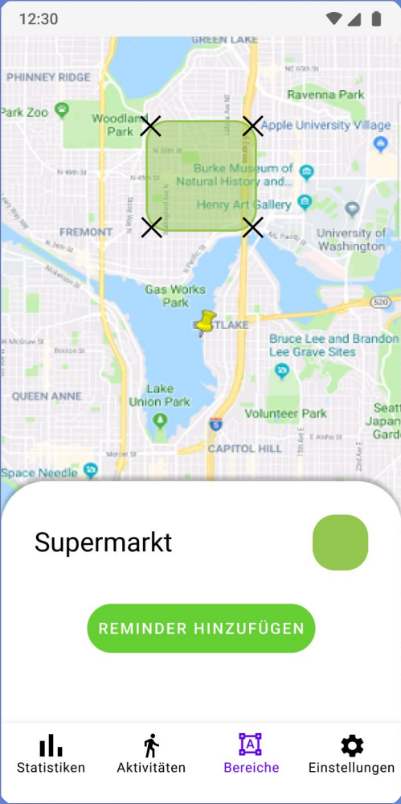
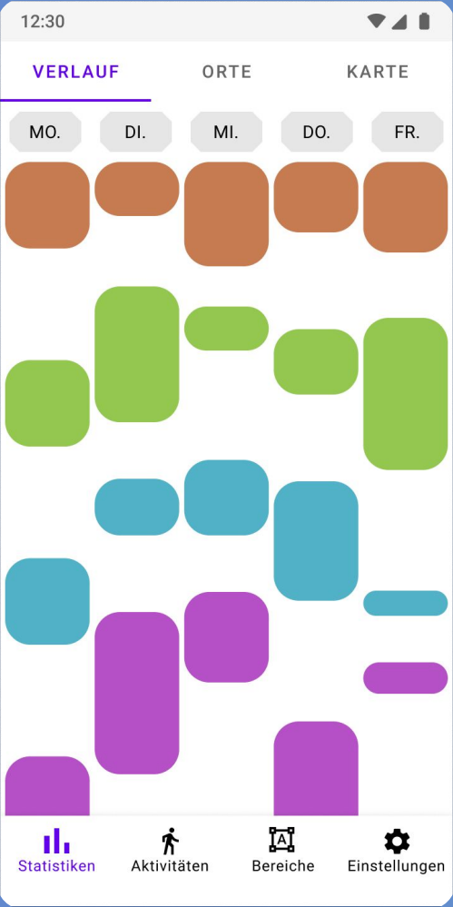
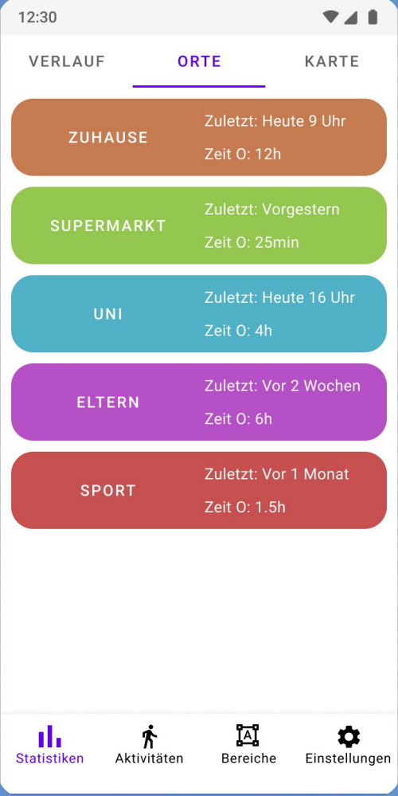
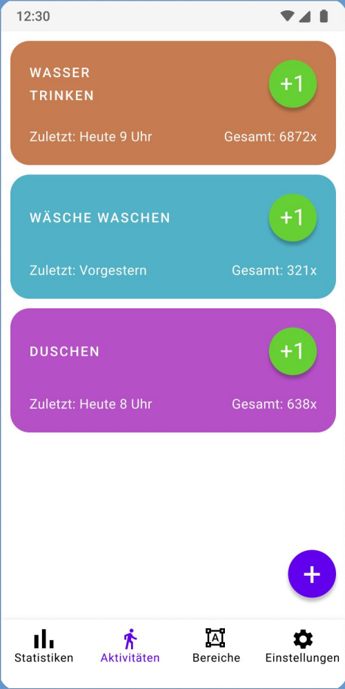

# MyTrack

MyTrack is an open source application to track and analyze your habits.

It is designed to monitor the environment of your device and adapt to changes.\
For example when you turn off your GPS, it will continue area tracking using the cellular network or by WiFi SSID fingerprinting.

## Functionality

- Define custom areas of interest
- Tracks your location in the background
- Weekly timeline of areas you were at
- Custom statistics for every defined area
- Keep track of custom activities with simple one-click counters

## Screenshots

